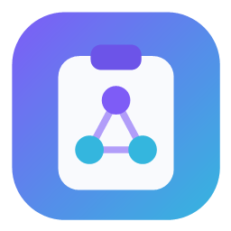

<p align="center"></p>

<h1 align="center">NetClipboard</h1>

Clipboard condivisa **peer-to-peer sulla LAN** per Windows, con **cronologia unificata
tra tutti i tuoi device** (un "Win+V" cross-device). Supporta **testo, immagini e file**.

Tray app leggera in **C# / WinForms / .NET 9**. Nessun server centrale.

🌐 **Sito**: https://blackslash76.github.io/NetClipboard/ · ⬇ **Download**: [Releases](https://github.com/Blackslash76/NetClipboard/releases/latest) · 📄 **Licenza**: [MIT](LICENSE)

## Come funziona

- **Identità per-dispositivo (niente password)**: ogni PC ha una coppia di chiavi
  ECDSA P-256 (privata protetta con DPAPI). L'**ID dispositivo** è l'impronta della
  chiave pubblica. La fiducia si concede una volta con un **pairing a codice** e si può
  **revocare** per singolo dispositivo. Modello stile Syncthing.
- **Scoperta** su più livelli (broadcast UDP, scansione di bootstrap, cache, gossip,
  IP manuali): l'annuncio è in chiaro, l'identità la verifica l'handshake.
- **Trasferimento (TCP)**: ogni connessione inizia con un **handshake autenticato**
  (ECDH effimero → forward secrecy) che stabilisce una chiave di sessione e un **codice
  a 6 cifre**; poi i dati viaggiano cifrati **AES-256-GCM**. Scambio dati solo tra
  dispositivi **fidati** (chiave pinnata). Il **gossip** tra fidati introduce gli altri
  → la mesh si forma da sola agganciandone uno.
- **File e cartelle in "delayed rendering"** (come Windows): copiando file/cartelle si
  condivide solo un *riferimento* (metadati: nomi, dimensioni, struttura). I byte partono
  **solo quando il destinatario incolla/materializza**, in streaming a chunk cifrati
  dall'host che possiede i file. Supporta **file multipli e cartelle annidate** (comprese
  quelle vuote).
- **Modalità ibrida**: di default ogni copia viene rispecchiata sugli altri PC; puoi
  mettere in pausa la condivisione dal menu tray (voce "Condivisione attiva").
- **Cronologia condivisa**: ogni contenuto (locale o ricevuto) entra in una history
  unificata, richiamabile con **Ctrl+Alt+V** (o doppio click sull'icona). Invio per
  incollare, tasto destro per fissare (pin) o eliminare.

> Nota su Win+V: rimpiazzare *letteralmente* la scorciatoia di sistema richiede di
> disabilitare la cronologia di Windows + un keyboard hook di basso livello. Per ora
> usiamo la nostra hotkey **Ctrl+Alt+V**; il rimpiazzo pieno è una feature successiva.

## Build

```powershell
dotnet build src\NetClipboard\NetClipboard.csproj -c Release
```

L'eseguibile è in `src\NetClipboard\bin\Release\net9.0-windows\NetClipboard.exe`.

## Primo avvio (su ogni PC)

1. Installa con **NetClipboard-Setup-x.y.z.exe** (installer classico, per-utente) oppure
   avvia direttamente il single-file `NetClipboard.exe` → icona nel system tray.
2. Menu tray → **"Configura firewall (admin)"** (una tantum, con UAC) se i PC non si vedono.
3. **Accoppia i dispositivi**: menu tray → **"Dispositivi e pairing…"**. Sul PC A scegli il
   PC B dall'elenco "In rete" (o inserisci il suo IP) e premi **Accoppia**. Su **entrambi**
   compare un **codice a 6 cifre**: confermalo solo se è identico sui due schermi. Da quel
   momento i due dispositivi sono fidati e condividono la clipboard.
   - Basta accoppiare un PC alla mesh: gli altri fidati vengono introdotti automaticamente.
   - Puoi **revocare** un dispositivo in qualsiasi momento dalla stessa finestra.

## Installer

La pipeline di release produce **NetClipboard-Setup-x.y.z.exe** (Inno Setup): installazione
**per-utente** in `%LocalAppData%\Programs\NetClipboard` (nessun admin), collegamenti nel
menu Start, opzioni "avvia con Windows" e icona sul desktop, e disinstallazione pulita.
L'installazione per-utente permette all'auto-update di sostituire l'eseguibile senza UAC.

## Menu tray

- **Condivisione attiva** — pausa/attiva il mirroring automatico.
- **Apri cronologia (Ctrl+Alt+V)** — popup della history cross-device.
- **Invia clipboard ora** — invio manuale on-demand ai peer.
- **Dispositivi** — elenco dei PC in linea.
- **Dispositivi e pairing…** — accoppia (codice), revoca, vedi l'impronta di questo PC.
- **Impostazioni…** — nome PC, porta, cronologia (numero/età), limite MB, tipi condivisi, aggiornamenti.
- **Configura firewall (admin)** / **Esci**.

## Aggiornamenti automatici (GitHub Releases, firmati)

L'app può aggiornarsi da **GitHub Releases**, con **firma crittografica**: accetta un
update solo se firmato con la chiave privata release (la pubblica è incorporata
nell'app). Così nessuno può iniettare un finto aggiornamento, anche se il canale
fosse compromesso. L'installazione è **con conferma**: l'app scarica e verifica in
background, poi avvisa e aspetta che tu scelga "Installa aggiornamento e riavvia".

Configurazione (una volta): in **Impostazioni → URL aggiornamenti** metti
`https://github.com/UTENTE/REPO/releases/latest/download/manifest.json`.

### Pubblicare una nuova versione

1. Alza `<Version>` in `NetClipboard.csproj` e ripubblica il single-file.
2. Firma la release (la chiave privata è in `.vault`, mai condivisa):
   ```powershell
   NetClipboard.exe --sign-release publish\NetClipboard.exe 1.1.0 `
     .vault\release-signing.key `
     https://github.com/UTENTE/REPO/releases/latest/download/NetClipboard.exe `
     manifest.json "Novità 1.1.0"
   ```
3. Crea la Release su GitHub (tag `v1.1.0`) e allega **`NetClipboard.exe`** e **`manifest.json`**.

I client vedono la nuova versione entro poche ore (o subito con "Controlla aggiornamenti").

> I segreti (chiave privata di firma) stanno in `.vault/`, esclusa da git. Non
> condividerla: chi la possiede può firmare aggiornamenti accettati dai client.

## Dove sono i dati

`%AppData%\NetClipboard\`
- `config.json` — configurazione. `identity.key` — chiave privata del dispositivo (DPAPI).
  `trusted.json` — dispositivi fidati (chiavi pubbliche pinnate).
- `history\` — indice cronologia + immagini.
- `received\` — file ricevuti dai peer.

## File e cartelle: come si incolla (v1)

Copiando file/cartelle il contenuto **non** viene inviato subito. Sul PC di destinazione:
apri la cronologia con **Ctrl+Alt+V**, seleziona la voce (marcata "da scaricare") →
i byte vengono scaricati dall'host in quel momento e messi in clipboard, **pronti da
incollare** con un normale Ctrl+V in Esplora file. Se l'host è offline compare un avviso.

> Prossimo passo: **Ctrl+V nativo** direttamente in Esplora (oggetto clipboard COM con
> rendering ritardato), così non serve passare dal popup.

## Limiti noti (v1)

- Testo e immagini viaggiano per valore, con limite configurabile (default 50 MB).
- I file usano il trasferimento on-demand (nessun limite pratico): l'host li streama a
  chunk da 64 KB solo su richiesta.
- **Scoperta dei peer** su più livelli, robusta anche quando la rete filtra il broadcast
  (Wi-Fi con isolamento client, ecc.):
  1. **Broadcast UDP** — istantaneo sulle reti normali.
  2. **Scansione TCP della subnet** — solo al **primo avvio** (bootstrap): prova a
     "bussare" a ogni IP della subnet sulla porta dedicata. Dopo, mai più in automatico.
  3. **Cache dei peer noti** — gli IP già visti vengono salvati e ripingati al riavvio
     (niente nuova scansione).
  4. **Gossip / mesh auto-assemblante** — a ogni handshake i nodi si scambiano la lista
     dei peer conosciuti: appena ti agganci a *un* nodo di una rete esistente, scopri
     automaticamente tutti gli altri (e loro te).
  5. **Pulsante "Cerca dispositivi in rete"** — scansione on-demand quando serve.
  6. **IP peer manuali** (Impostazioni) — fallback esplicito; reciproco, basta che un
     solo PC inserisca l'IP dell'altro.

  Nota: la scansione della subnet può far scattare i sistemi di sicurezza di reti
  aziendali (sembra un port-scan): per questo è limitata al bootstrap + on-demand, e
  disattivabile da Impostazioni ("Scoperta automatica"). Gli IP sono statici: con DHCP
  conviene riservarli sul router.
- I metadati di cartelle molto grandi vengono calcolati al momento della copia sul thread
  UI: con decine di migliaia di file la copia può richiedere un attimo (cap a 50k voci).

## Struttura del codice

```
src/NetClipboard/
├─ Program.cs                entry, single-instance, --install-firewall
├─ AppConfig.cs              config JSON
├─ Core/Security/            identità (ECDSA), handshake+SAS, sessione, trust store
├─ Update/Updater.cs         auto-update firmato
├─ Core/
│  ├─ SecureChannel.cs       AES-256-GCM + PBKDF2
│  ├─ ClipboardPayload.cs    modello + (de)serializzazione binaria
│  ├─ ClipboardMonitor.cs    WM_CLIPBOARDUPDATE, hotkey, anti-loop
│  └─ ClipboardHistory.cs    cronologia unificata + persistenza
├─ Net/
│  ├─ Peer.cs / PeerDiscovery.cs   annunci UDP cifrati
│  ├─ ClipboardTransport.cs        server+client TCP
│  └─ FirewallHelper.cs            regola firewall via UAC
└─ Ui/
   ├─ TrayContext.cs         orchestratore (system tray)
   ├─ HistoryForm.cs         popup cronologia
   └─ SettingsForm.cs        impostazioni
```
